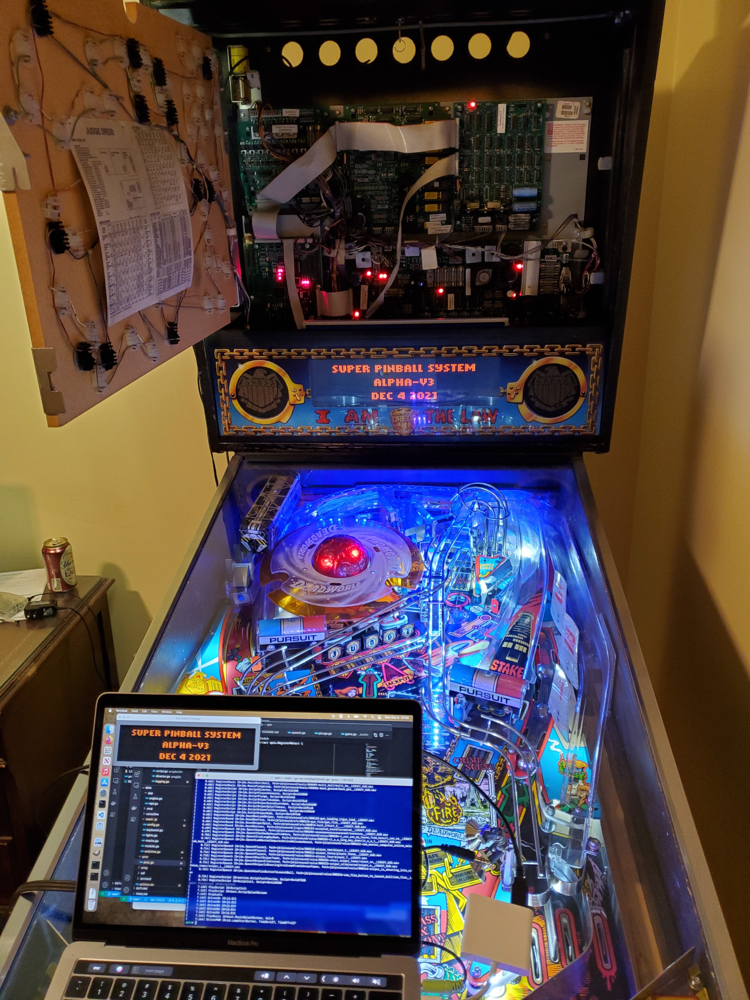

# spin

The Super Pinball System.

Yes, that is a generic name, but it makes for a great package name.
And it is the name of a [great venue in DC](https://wearespin.com/location/washington-dc/).

I am now an owner of a Judge Dredd pinball machine.

It came with a color dot-matrix display, LED lighting, and even a
secondary power supply. That means it is time to get back to doing some pinball development work. I am using the [P-ROC](https://www.multimorphic.com/store/circuit-boards/p-roc/) to control the machine via USB. I've already blown one fuse by hooking it up wrong.

## Plan

I would like to do the following:

- Judge Dredd Remix: The Judge Dredd we all know and love but with some improvements and tweaks here and there.
- Speed Run: A game that takes 45 minutes to play when done efficiently. A lot longer when not done efficiently. Probably a Mega Man theme.
- Single Ball Challenge: One ball, simple progression of objectives, get as many points as possible. Dr. Mario themed.
- PinGolf: Because everyone loves this. Maybe bring in some No Good Gofers? So appropriate since this is written in Go!
- Tribute: Fan service to the great games out there. This may or may not be a good idea.

## Status

A work in progress. Judge Dredd Remix is first.

v3-alpha was for putting in the P-ROC and giving the code a first test drive.
The next version will be to get a playable ball that doesn't get stuck anywhere.

## License

MIT
