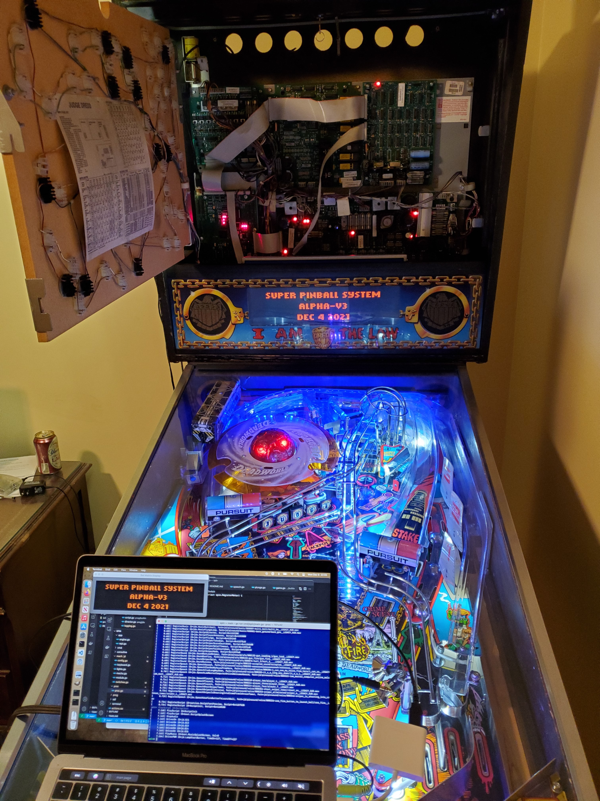

# spin

The Super Pinball System.

Yes, that is a generic name, but it makes for a great package name.
And it is the name of a [great venue in DC](https://wearespin.com/location/washington-dc/).

I am now an owner of a Judge Dredd pinball machine.

It came with a [color dot-matrix display](https://www.colordmd.com/), LED
lighting, and even a secondary power supply. That means it is time to get back
to doing some pinball development work. I am using the
[P-ROC](https://www.multimorphic.com/store/circuit-boards/p-roc/) to control
the machine via USB. I've already blown one fuse by hooking it up wrong.

## Plan

I already have a working version written in Go in the
[main](https://github.com/drop-target-pinball/spin/tree/main) branch. But,
I do need to learn some Rust. And while we are at it, why not change the
game logic to use Lua? This branch is the result of that work.

Click here for the [Judge Dredd](https://github.com/drop-target-pinball/judge-dredd) game implementation in progress.

## Demos

### Alpha 1

## Development

This project has been tested on Ubuntu and macOS.

### Ubuntu

First install rust:

    curl --proto '=https' --tlsv1.2 -sSf https://sh.rustup.rs | sh

Install system dependencies:

    sudo apt install \
        git-lfs \
        build-essential \
        pkg-config \
        lua5.4 liblua5.4-dev \
        libsdl2{,-image,-mixer,-ttf,-gfx}-dev

### macOS

TBD

### Running Judge Dredd

*NOTE*: This requires resources that cannot be publicly shared on GitHub. You
will need access to the private repository for this to work.

Clone the Judge Dredd repository and place it in the parent directory:

    git clone --recurse-submodules \
        https://github.com/drop-target-pinball/judge-dredd.git \
        ../judge-dredd
    export SPIN_DIR=$(pwd)/../judge-dredd

To start with no scripts running:

    cargo run

At the spin prompt, start the main script:

    run('main')

To automatically start the init script, use:

    cargo run -- init

## License

MIT
